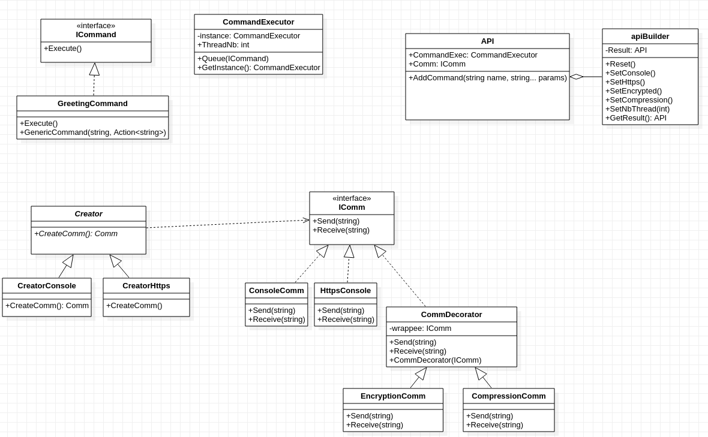

# Communications S2S

## Utiliser notre librairie

**Nom de librairie :** ServerToServerCommunication  
**Utilisation :**
- Importer le `.dll` de la librairie dans votre projet;
- Créer une instance d'`ApiBuider` pour créer votre instance de l'API;
- Configurer votre instance de l'API avec les méthodes suivantes :
	- `setThread(int nb_thread)`
	- `setHttp()` pour une communication http
	- `setConsole()` pour une communication console
	- `setCompression()` et `setEncrypted()` respectivement pour la compression et l'encryption

*Note : le protocole utilisé doit être défini avant les propritétés des flux. Un seul protocole n'est disponible par instance d'api. Il n'y a pas de limite aux proprietés de flux.*

Utiliser `GetResult()` pour retouner un objet `Api` avec les paramètres précédemment definis. La commande `SendCommand(string command_name)` permet d'exécuter et envoyer le résultats des commandes definies par la librairie. Actuellement la commande "hello" affiche le message "hello ..." avec comme fin de message le deuxieme paramètre de la commande.

*Note: si le programme fini avant les threads, le resultat des threads n'apparait pas.*

Voici un programme de test pour créer une instance de l'API et envoyer des commandes (exécuter les commandes et envoyer les résultats chiffrées et compressées sur le cannal de communication de la console) :
```csharp
var apiBuilder = new ApiBuilder();
apiBuilder.SetThread(4);
apiBuilder.SetConsole();
apiBuilder.SetCompression();
apiBuilder.SetEncrypted();

var api = apiBuilder.GetResult();
api.SendCommand("hello", "romain");
api.SendCommand("hello");

Console.ReadKey();
```
## Réponses aux questions
**1 - Est-ce que le patron Singleton s’applique à votre système de tâches? Si oui, pouvez vous citer une solution qui n’utilisera pas ce dernier ?**  
Oui, ce patron s'applique sur notre système de tâches, car il faut que notre CommandExecutor gère les threads de manière globale et unique afin que chacun puisse y accéder pour ajouter des commandes a exécuter.  
On pourrait utiliser l'injection de dépendance pour pallier les inconvénients d'un singleton.

**2 - Quel patron va-vous aider à construire des flux basés sur un protocole tout en gardant toujours la même interface?**  
Le patron nous aidant à construire ces flux est le Factory.

**3 - Quel patron utiliser pour composer les flux afin de créer des flux chiffrés et compressés?**  
Le patron à utiliser pour composer les flux chiffrés et compressés est le decorateur.

**4 - Est-ce que votre instance de protocole de communication devrait être un flux? Pourquoi?**  
Non, il n'est pas forcément un flux, ce n'est pas nécessaire mais possible.
Le protocole de communication peut être une propriété du flux ou un flux à part entière.

**5 - Quel patron va-vous permettre de construire votre instance en permettant de facilement ajouter des paramètres de construction plus tard?**  
Le patron nous permettant de construire notre instance en permettant de facilement ajotuer des paramètres de construction plus tard est le builder.

**6 - Est-ce que cette instance de classe devrait être un singleton? Pourquoi?**  
Il n'est pas logique que 2 instances utilisent le même Builder, alors qu'il peut en utiliser un autre.

**7 - Comment prévenir l’utilisateur que la tâche est terminée ? Proposez au moins un patron qui s’applique parfaitement à ce cas très précis**
On peut prévenir l'utilisateur que la tâche est terminée avec un pattern observer, qui s'adapte dans ce cas-ci. Nous avons choisi de prévenir que la tâche est fini avec une lambda que l'initiateur de la commande défini lors de la construction de cette dernière.

### UML

